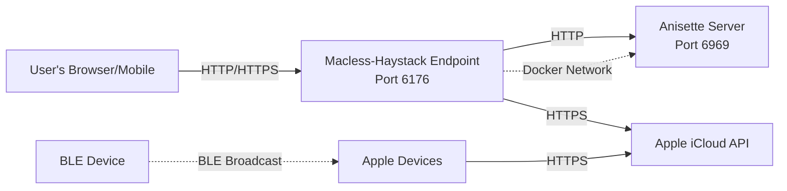

# Macless-Haystack Dataflow Diagram

This document provides a comprehensive dataflow diagram for the Macless-Haystack system, illustrating how data flows through the various components.

## System Overview

Macless-Haystack is a distributed system for tracking BLE devices using Apple's Find My network without requiring a Mac. The system consists of:

- **Key Generation Tool**: Python script for generating cryptographic keypairs
- **BLE Devices**: ESP32/NRF5x firmware broadcasting advertisement keys
- **Apple Find My Network**: Apple's infrastructure for collecting location reports
- **Backend Endpoint**: Python HTTP server for authenticating with Apple and fetching reports
- **Frontend Application**: Flutter-based web/mobile app for viewing device locations

## Dataflow Diagram

```mermaid
flowchart TB
    subgraph User["User Domain"]
        U[User]
        GenKeys[generate_keys.py]
        KeyFiles[(Key Files<br/>- Private Keys<br/>- Advertisement Keys<br/>- Hashed Keys)]
    end

    subgraph BLE["BLE Device Domain"]
        ESP32[ESP32/NRF5x<br/>Firmware]
        BLEAdv[BLE Advertisement<br/>Broadcast]
    end

    subgraph Apple["Apple Find My Network"]
        AppleDevices[Apple Devices<br/>iPhone/iPad/Mac]
        AppleServers[Apple iCloud<br/>Servers]
        FindMyDB[(Location Reports<br/>Database)]
    end

    subgraph Backend["Backend Endpoint (Python)"]
        Endpoint[mh_endpoint.py<br/>HTTP Server]
        Auth[apple_cryptography.py<br/>pypush_gsa_icloud.py<br/>Authentication]
        Config[(auth.json<br/>config.ini)]
        Anisette[Anisette Server<br/>Device Provisioning]
    end

    subgraph Frontend["Frontend Application (Flutter)"]
        FlutterApp[Flutter Web/Mobile App]
        ReportsFetcher[reports_fetcher.dart<br/>HTTP Client]
        Decrypt[decrypt_reports.dart<br/>AES-GCM Decryption]
        Display[Map & UI<br/>Location Display]
    end

    %% Key Generation Flow
    U -->|1. Run| GenKeys
    GenKeys -->|2. Generate keypairs| KeyFiles
    KeyFiles -->|3a. Flash keyfile| ESP32
    KeyFiles -->|3b. Import JSON| FlutterApp

    %% BLE Advertisement Flow
    ESP32 -->|4. Broadcast every 2s| BLEAdv
    BLEAdv -.->|5. Receive broadcasts| AppleDevices

    %% Apple Network Flow
    AppleDevices -->|6. Upload encrypted<br/>location reports| AppleServers
    AppleServers -->|7. Store reports| FindMyDB

    %% Authentication Flow
    U -->|8. Provide Apple ID<br/>+ 2FA| Endpoint
    Endpoint -->|9. Request anisette<br/>headers| Anisette
    Anisette -->|10. Return device<br/>metadata| Endpoint
    Endpoint -->|11. Authenticate with<br/>Apple credentials| Auth
    Auth -->|12. GSA/iCloud<br/>authentication| AppleServers
    AppleServers -->|13. Return auth tokens<br/>(dsid, searchPartyToken)| Auth
    Auth -->|14. Store tokens| Config

    %% Report Fetching Flow
    FlutterApp -->|15. Request location<br/>updates (hashed keys)| ReportsFetcher
    ReportsFetcher -->|16. POST /fetch<br/>+ credentials| Endpoint
    Endpoint -->|17. Verify auth| Config
    Endpoint -->|18. Generate anisette| Anisette
    Anisette -->|19. Headers| Endpoint
    Endpoint -->|20. Fetch reports<br/>from iCloud| AppleServers
    AppleServers -->|21. Query database| FindMyDB
    FindMyDB -->|22. Return encrypted<br/>location reports| AppleServers
    AppleServers -->|23. Send encrypted<br/>reports| Endpoint
    Endpoint -->|24. Filter by date<br/>and return JSON| ReportsFetcher
    ReportsFetcher -->|25. Encrypted<br/>reports| Decrypt
    Decrypt -->|26. Decrypt with<br/>private key (ECDH)| Display
    Display -->|27. Show locations<br/>on map| U

    %% Styling
    classDef userClass fill:#e1f5ff,stroke:#01579b,stroke-width:2px
    classDef bleClass fill:#fff3e0,stroke:#e65100,stroke-width:2px
    classDef appleClass fill:#f3e5f5,stroke:#4a148c,stroke-width:2px
    classDef backendClass fill:#e8f5e9,stroke:#1b5e20,stroke-width:2px
    classDef frontendClass fill:#fff9c4,stroke:#f57f17,stroke-width:2px

    class U,GenKeys,KeyFiles userClass
    class ESP32,BLEAdv bleClass
    class AppleDevices,AppleServers,FindMyDB appleClass
    class Endpoint,Auth,Config,Anisette backendClass
    class FlutterApp,ReportsFetcher,Decrypt,Display frontendClass
```

## Detailed Data Flow Description

### Phase 1: Key Generation & Deployment (Steps 1-3)

1. **User runs generate_keys.py**: The user executes the key generation script
2. **Generate keypairs**: Script generates:
   - Private keys (SECP224R1 elliptic curve)
   - Advertisement keys (public key x-coordinate)
   - Hashed advertisement keys (SHA256)
   - Output files: `PREFIX_keyfile`, `PREFIX_devices.json`, `PREFIX.keys`
3. **Deployment**:
   - 3a: Flash `PREFIX_keyfile` to ESP32/NRF5x device
   - 3b: Import `PREFIX_devices.json` to Flutter app

### Phase 2: BLE Advertisement (Steps 4-7)

4. **BLE Broadcast**: ESP32/NRF5x firmware broadcasts BLE advertisements every 2 seconds containing the advertisement key
5. **Apple Device Reception**: Nearby Apple devices (iPhones, iPads, Macs) passively receive the BLE advertisements
6. **Location Report Upload**: Apple devices encrypt the location data and upload reports to Apple's iCloud servers
7. **Storage**: Apple stores the encrypted location reports in their Find My database

### Phase 3: Backend Authentication (Steps 8-14)

8. **User Authentication**: User provides Apple ID credentials and 2FA code to the backend endpoint
9. **Anisette Request**: Backend requests device provisioning headers from Anisette server
10. **Anisette Headers**: Anisette returns device metadata (X-Apple-I-MD, X-Apple-I-MD-M)
11. **Authentication Process**: Backend initiates authentication using `apple_cryptography.py` and `pypush_gsa_icloud.py`
12. **GSA/iCloud Auth**: Performs SRP authentication with Apple's GSA (GrandSlam Authentication) service and iCloud
13. **Token Return**: Apple returns authentication tokens (dsid, searchPartyToken)
14. **Token Storage**: Tokens are stored in `auth.json` for future requests

### Phase 4: Location Report Retrieval (Steps 15-27)

15. **User Request**: Flutter app requests location updates for tracked devices
16. **HTTP POST**: ReportsFetcher sends POST request to endpoint with hashed advertisement keys
17. **Authentication Check**: Endpoint verifies credentials from request
18. **Generate Headers**: Request fresh anisette headers
19. **Header Return**: Anisette provides current headers
20. **Fetch Reports**: Endpoint queries Apple's iCloud API endpoint (`https://gateway.icloud.com/acsnservice/fetch`)
21. **Database Query**: Apple queries their Find My location database
22. **Encrypted Reports**: Database returns encrypted location reports
23. **Report Transmission**: Apple sends reports to endpoint
24. **Filter & Return**: Endpoint filters reports by date range and returns JSON to Flutter app
25. **Pass to Decryption**: ReportsFetcher passes encrypted reports to DecryptReports module
26. **Decrypt Reports**: 
    - Performs ECDH (Elliptic Curve Diffie-Hellman) key exchange
    - Derives symmetric key using ANSI X.963 KDF
    - Decrypts payload using AES-GCM
    - Extracts latitude, longitude, accuracy, confidence, and battery status
27. **Display**: Decrypted location data is shown on the map interface

## Key Data Structures

### Advertisement Key (28 bytes)
- SECP224R1 elliptic curve public key x-coordinate
- Broadcast by BLE device
- Base64 encoded in key files

### Private Key (28 bytes)
- SECP224R1 elliptic curve private key
- Used for decrypting location reports
- Stored securely in Flutter app

### Location Report Payload (encrypted)
```
Timestamp (4 bytes) | Confidence (1 byte) | Ephemeral Key (57 bytes) | 
Encrypted Data (10 bytes) | Auth Tag (16 bytes)
```

### Encrypted Data (after decryption)
```
Latitude (4 bytes) | Longitude (4 bytes) | Accuracy (1 byte) | Status (1 byte)
```

## Security Considerations

1. **End-to-End Encryption**: Location reports are encrypted by Apple devices and can only be decrypted with the private key
2. **Authentication**: Backend endpoint requires Apple ID with 2FA
3. **Optional Endpoint Protection**: Endpoint can be configured with HTTP Basic authentication
4. **Key Storage**: Private keys should be stored securely in the Flutter app
5. **Token Management**: Authentication tokens are cached to minimize authentication requests

## Network Protocols

- **BLE Advertisement**: Bluetooth Low Energy 4.0+
- **Backend API**: HTTP/HTTPS REST API
- **Apple iCloud API**: HTTPS with custom authentication headers
- **Anisette**: HTTP REST API for device provisioning data

## Key Components and Their Responsibilities

| Component | Primary Responsibility | Key Files |
|-----------|------------------------|-----------|
| Key Generator | Cryptographic key generation | `generate_keys.py` |
| BLE Firmware | Advertisement broadcasting | ESP32/NRF5x firmware |
| Backend Endpoint | Apple authentication & report fetching | `mh_endpoint.py`, `pypush_gsa_icloud.py` |
| Anisette Server | Device provisioning data | External Docker container |
| Flutter Frontend | User interface & report decryption | `reports_fetcher.dart`, `decrypt_reports.dart` |
| Apple Find My Network | Location report collection & storage | Apple's infrastructure |

## Deployment Architecture



## Conclusion

This dataflow diagram illustrates the complete lifecycle of location tracking in the Macless-Haystack system, from key generation to location visualization. The system leverages Apple's Find My network infrastructure while maintaining end-to-end encryption and user control over their tracking devices.
