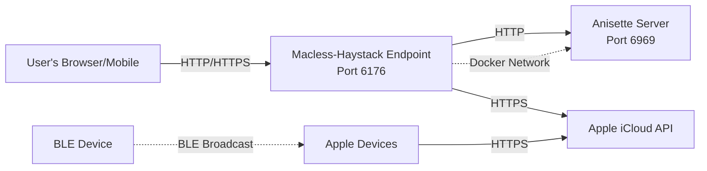

# Macless-Haystack Dataflow Diagram

This document provides a comprehensive dataflow diagram for the Macless-Haystack system, illustrating how data flows through the various components.

## System Overview

Macless-Haystack is a distributed system for tracking BLE devices using Apple's Find My network without requiring a Mac. The system consists of:

- **Key Generation Tool**: Python script for generating cryptographic keypairs
- **BLE Devices**: ESP32/NRF5x firmware broadcasting advertisement keys
- **Apple Find My Network**: Apple's infrastructure for collecting location reports
- **Backend Endpoint**: Python HTTP server for authenticating with Apple and fetching reports
- **Frontend Application**: Flutter-based web/mobile app for viewing device locations

## Dataflow Diagram

```mermaid
flowchart LR
    subgraph UserDomain ["User Domain"]
        direction TB
        U[User]
        GenKeys[generate_keys.py]
        KeyFiles[(Key Files<br/>- Private Keys<br/>- Public Keys)]
    end

    subgraph BLE ["BLE Device Domain"]
        direction TB
        ESP32[ESP32/NRF5x<br/>Firmware]
        BLEAdv[BLE Advertisement<br/>Broadcast]
    end

    subgraph Frontend ["Frontend Application (Flutter)"]
        direction TB
        FlutterApp[Flutter Web/Mobile App]
        ReportsFetcher[reports_fetcher.dart<br/>HTTP Client]
        Decrypt[decrypt_reports.dart<br/>AES-GCM Decryption]
        Display[Map & UI<br/>Location Display]
    end

    subgraph Backend ["Backend Endpoint (Python)"]
        direction TB
        Endpoint[mh_endpoint.py<br/>HTTP Server]
        Auth[apple_cryptography.py<br/>pypush_gsa_icloud.py<br/>Authentication]
        Config[(auth.json<br/>config.ini)]
    end

    subgraph AnisetteDomain ["Anisette Server"]
        Anisette[Anisette Server<br/>Device Provisioning]
    end

    subgraph Apple ["Apple Find My Network"]
        direction TB
        AppleDevices[Apple Devices<br/>iPhone/iPad/Mac]
        AppleServers[Apple iCloud<br/>Servers]
    end
    subgraph OperatorDomain ["Operator"]
        direction TB
        Operator[Operator]
    end
    %% Key Generation Flow
    U -->|1. Run| GenKeys
    GenKeys -->|2. Generate keypairs| KeyFiles
    KeyFiles -->|3a. Flash keyfile| ESP32
    KeyFiles -->|3b. Import JSON| FlutterApp

    %% BLE Advertisement Flow
    ESP32 -->|4. Broadcast every 60s| BLEAdv
    BLEAdv -.->|5. Receive broadcasts| AppleDevices

    %% Apple Network Flow
    AppleDevices -->|6. Upload encrypted<br/>location reports| AppleServers

    %% Authentication Flow
    Operator -->|8. Provide Apple ID<br/>+ 2FA| Endpoint
    Auth -->|9. Request anisette<br/>headers| Anisette
    Anisette -->|10. Return device<br/>metadata| Auth
    Endpoint -->|11. Authenticate with<br/>Apple credentials| Auth
    Auth -->|12. GSA/iCloud<br/>authentication| AppleServers
    AppleServers -->|13. Return auth tokens<br/>dsid, searchPartyToken| Auth
    Auth -->|14. Store tokens| Config

    %% Report Fetching Flow
    FlutterApp -->|15. Request location<br/>updates with hashed keys| ReportsFetcher
    ReportsFetcher -->|16. POST /fetch<br/>+ credentials| Endpoint
    Endpoint -->|17. Verify auth| Config
    Endpoint -->|20. Fetch reports<br/>from iCloud| AppleServers
    AppleServers -->|23. Send encrypted<br/>reports| Endpoint
    Endpoint -->|24. Filter by date<br/>and return JSON| ReportsFetcher
    ReportsFetcher -->|25. Encrypted<br/>reports| Decrypt
    Decrypt -->|26. Decrypted reports| Display
    Display -->|27. Show locations<br/>on map| U

    %% Styling
    classDef userClass fill:#e1f5ff,stroke:#01579b,stroke-width:2px
    classDef bleClass fill:#fff3e0,stroke:#e65100,stroke-width:2px
    classDef appleClass fill:#f3e5f5,stroke:#4a148c,stroke-width:2px
    classDef backendClass fill:#e8f5e9,stroke:#1b5e20,stroke-width:2px
    classDef frontendClass fill:#fff9c4,stroke:#f57f17,stroke-width:2px
    classDef anisetteClass fill:#fce4ec,stroke:#880e4f,stroke-width:2px

    class U,GenKeys,KeyFiles,UserDomain userClass
    class ESP32,BLEAdv,BLE bleClass
    class AppleDevices,AppleServers,FindMyDB,Apple appleClass
    class Endpoint,Auth,Config,Backend backendClass
    class FlutterApp,ReportsFetcher,Decrypt,Display,Frontend frontendClass
    class Anisette,AnisetteDomain anisetteClass
```


## Detailed Data Flow Description

### Phase 1: Key Generation & Deployment (Steps 1-3)

1. **User runs generate_keys.py**: The user executes the key generation script
2. **Generate keypairs**: Script generates:
   - Private keys (SECP224R1 elliptic curve)
   - Advertisement keys (public key x-coordinate)
   - Hashed advertisement keys (SHA256)
   - Output files: `PREFIX_keyfile`, `PREFIX_devices.json`, `PREFIX.keys`
3. **Deployment**:
   - 3a: Flash `PREFIX_keyfile` to ESP32/NRF5x device
   - 3b: Import `PREFIX_devices.json` to Flutter app

### Phase 2: BLE Advertisement (Steps 4-7)

4. **BLE Broadcast**: ESP32/NRF5x firmware broadcasts BLE advertisements every 2 seconds containing the advertisement key
5. **Apple Device Reception**: Nearby Apple devices (iPhones, iPads, Macs) passively receive the BLE advertisements
6. **Location Report Upload**: Apple devices encrypt the location data and upload reports to Apple's iCloud servers
7. **Storage**: Apple stores the encrypted location reports in their Find My database

### Phase 3: Backend Authentication (Steps 8-14)

8. **User Authentication**: User provides Apple ID credentials and 2FA code to the backend endpoint
9. **Anisette Request**: Backend requests device provisioning headers from Anisette server
10. **Anisette Headers**: Anisette returns device metadata (X-Apple-I-MD, X-Apple-I-MD-M)
11. **Authentication Process**: Backend initiates authentication using `apple_cryptography.py` and `pypush_gsa_icloud.py`
12. **GSA/iCloud Auth**: Performs SRP authentication with Apple's GSA (GrandSlam Authentication) service and iCloud
13. **Token Return**: Apple returns authentication tokens (dsid, searchPartyToken)
14. **Token Storage**: Tokens are stored in `auth.json` for future requests

### Phase 4: Location Report Retrieval (Steps 15-27)

15. **User Request**: Flutter app requests location updates for tracked devices
16. **HTTP POST**: ReportsFetcher sends POST request to endpoint with hashed advertisement keys
17. **Authentication Check**: Endpoint verifies credentials from request
18. **Generate Headers**: Request fresh anisette headers
19. **Header Return**: Anisette provides current headers
20. **Fetch Reports**: Endpoint queries Apple's iCloud API endpoint (`https://gateway.icloud.com/acsnservice/fetch`)
21. **Database Query**: Apple queries their Find My location database
22. **Encrypted Reports**: Database returns encrypted location reports
23. **Report Transmission**: Apple sends reports to endpoint
24. **Filter & Return**: Endpoint filters reports by date range and returns JSON to Flutter app
25. **Pass to Decryption**: ReportsFetcher passes encrypted reports to DecryptReports module
26. **Decrypt Reports**: 
    - Performs ECDH (Elliptic Curve Diffie-Hellman) key exchange
    - Derives symmetric key using ANSI X.963 KDF
    - Decrypts payload using AES-GCM
    - Extracts latitude, longitude, accuracy, confidence, and battery status
27. **Display**: Decrypted location data is shown on the map interface

## Key Data Structures

### Advertisement Key (28 bytes)
- SECP224R1 elliptic curve public key x-coordinate
- Broadcast by BLE device
- Base64 encoded in key files

### Private Key (28 bytes)
- SECP224R1 elliptic curve private key
- Used for decrypting location reports
- Stored securely in Flutter app

### Location Report Payload (encrypted)
```
Timestamp (4 bytes) | Confidence (1 byte) | Ephemeral Key (57 bytes) | 
Encrypted Data (10 bytes) | Auth Tag (16 bytes)
```

### Encrypted Data (after decryption)
```
Latitude (4 bytes) | Longitude (4 bytes) | Accuracy (1 byte) | Status (1 byte)
```

## Security Considerations

1. **End-to-End Encryption**: Location reports are encrypted by Apple devices and can only be decrypted with the private key
2. **Authentication**: Backend endpoint requires Apple ID with 2FA
3. **Optional Endpoint Protection**: Endpoint can be configured with HTTP Basic authentication
4. **Key Storage**: Private keys should be stored securely in the Flutter app
5. **Token Management**: Authentication tokens are cached to minimize authentication requests

## Network Protocols

- **BLE Advertisement**: Bluetooth Low Energy 4.0+
- **Backend API**: HTTP/HTTPS REST API
- **Apple iCloud API**: HTTPS with custom authentication headers
- **Anisette**: HTTP REST API for device provisioning data

## Key Components and Their Responsibilities

| Component | Primary Responsibility | Key Files |
|-----------|------------------------|-----------|
| Key Generator | Cryptographic key generation | `generate_keys.py` |
| BLE Firmware | Advertisement broadcasting | ESP32/NRF5x firmware |
| Backend Endpoint | Apple authentication & report fetching | `mh_endpoint.py`, `pypush_gsa_icloud.py` |
| Anisette Server | Device provisioning data | External Docker container |
| Flutter Frontend | User interface & report decryption | `reports_fetcher.dart`, `decrypt_reports.dart` |
| Apple Find My Network | Location report collection & storage | Apple's infrastructure |

## Deployment Architecture



## Privacy and Security Threat Analysis (LINDDUN)

This section provides a LINDDUN-based privacy threat analysis of the Macless-Haystack system, examining each interaction in the dataflow for potential privacy and security risks.

### Threat Analysis Table

| Code | Threat Category | Description | Affected Interaction(s) | Severity | Mitigation |
|------|----------------|-------------|------------------------|----------|------------|
| **DD.4.2 / NC.2** | Data Disclosure / Non-Compliance | Storage of private and public keys in plain text. Keys should be stored using platform-specific secure storage (Apple Keychain, Android Keystore, GNOME Keyring, Windows Credential Manager). | Interaction 2, 3b | High | Implement secure key storage using platform APIs (e.g., flutter_secure_storage) |
| **U.1.2** | Unawareness | Users are not informed that sharing their private key with others enables complete location tracking of their device. Lacks clear privacy warnings. | Interaction 2 | Medium | Add explicit privacy warnings in documentation and UI when exporting keys |
| **NC.1.2.a** | Regulatory Non-Compliance | Potential violation of Apple's EULA by creating custom AirTag-like devices using Apple's Find My network infrastructure. | Interaction 3a, 4 | Medium | Add legal disclaimer; users assume responsibility |
| **I.2.2.a** | Information Disclosure | Firmware compilation metadata (compile time, ESP-IDF version, toolchain info) is printed on device boot, potentially identifying the individual who compiled/flashed the firmware. | Interaction 3a | Low | Strip debug information and metadata from production firmware builds |
| **L.1.1 / I.2.2.b** | Linkability / Information Disclosure | Static advertisement keys allow tracking of device presence. The system broadcasts the same public key continuously, enabling anyone to determine if the tracked device (and by extension, its owner) is nearby. | Interaction 4 | High | Implement key rotation mechanism (firmware currently rotates every 30 min for multi-key setups) |
| **D.3** | Detectability | Static advertisement keys allow querying Apple servers to determine if a tracker is still active by checking for new location reports, even without decryption. | Interaction 4, 20 | Medium | Key rotation partially mitigates this; inherent to Find My protocol |
| **NC.3.a** | Non-Compliance | Apple ID and password can be stored in plain text in `config.ini` (optional but supported). Exposes credentials to anyone with filesystem access. | Interaction 8, 14 | Critical | Remove plain text password storage; require interactive login only |
| **I.1.1** | Information Disclosure | Apple ID and authentication tokens stored in plain text in `auth.json` on the API server. | Interaction 8, 13, 14 | High | Encrypt token storage using system keyring or encrypted configuration |
| **NR.1.1.a** | Non-Repudiation | Apple ID is attached to all location report requests, allowing Apple to identify and track Macless-Haystack users and their query patterns. | Interaction 8, 11, 12, 13, 20 | Medium | Inherent to Apple's authentication; no mitigation without protocol changes |
| **L.1.1.a / NR.1.1.b** | Linkability / Non-Repudiation | IP address and metadata sent to Anisette server operator reveals user identity and activity. The Anisette host can correlate requests and identify users bypassing Apple's device restrictions. | Interaction 9, 18 | Medium | Use privacy-preserving proxy or run own Anisette server |
| **I.2.2.c** | Information Disclosure | System locale and timezone exposed in authentication metadata headers, potentially revealing user's geographic location. | Interaction 10, 19 | Low | Randomize or normalize locale/timezone in headers |
| **NC.1.2.b** | Regulatory Non-Compliance | Reverse engineering and accessing iCloud authentication from non-Apple devices violates Apple's EULA and potentially DMCA anti-circumvention provisions. | Interaction 11, 12, 13 | Medium | Legal disclaimer; users assume legal responsibility |
| **D.1** | Detectability | Network traffic to public Macless-Haystack endpoints can be detected, indicating EULA violations and non-Apple device usage. | Interaction 15, 16 | Low | Use HTTPS; consider VPN for additional privacy |
| **L.2.2.1** | Linkability | Sending private keys to potentially public endpoint links user's IP address with their tracked devices. Endpoint operator can decrypt all location history. | Interaction 15, 16 | Critical | Only use trusted, self-hosted endpoints; implement end-to-end encryption for API |
| **NC.3.b** | Non-Compliance | HTTP access is supported (non-mandatory HTTPS), exposing private keys during transmission. Man-in-the-middle attackers can capture keys and track devices indefinitely. | Interaction 15, 16, 24 | Critical | Enforce HTTPS mandatory; disable HTTP in production |
| **NC.3.c** | Non-Compliance | Weak authentication: no authentication required by default, or single username/password shared among all users of an endpoint instance. | Interaction 15, 16, 17, 24 | High | Implement per-user authentication; support OAuth or token-based auth |
| **DD.3.a** | Data Disclosure | Endpoint operator receives and temporarily stores private keys in memory during request processing, enabling location decryption. | Interaction 16, 20, 23, 24 | Critical | Implement client-side decryption only; backend should never receive private keys |
| **I.1.2** | Information Disclosure | Apple servers receive and log query metadata (timestamps, query frequency, advertisement key hashes) revealing usage patterns. | Interaction 20, 21 | Medium | Inherent to protocol; rate limiting and query batching can reduce exposure |
| **DD.2.1** | Data Disclosure | Encrypted location reports transmitted from Apple to endpoint. While encrypted, metadata (timestamp, report count) leaks information about device activity. | Interaction 23 | Low | Inherent to protocol design |
| **I.2.3** | Information Disclosure | Endpoint filters and processes reports, potentially logging query parameters and filter criteria, revealing user interests in specific time periods. | Interaction 24 | Low | Disable verbose logging; implement log rotation and retention policies |
| **DD.1.1** | Data Disclosure | Decryption process requires private key in client memory, vulnerable to memory dumps or malware if device is compromised. | Interaction 25, 26 | Medium | Use secure enclaves where available; implement anti-debugging |
| **I.3.1** | Information Disclosure | Decrypted location data displayed in UI can be screen-captured or observed by shoulder-surfing. | Interaction 27 | Low | Implement privacy screen mode; blur locations until authenticated |

### Threat Categories Reference

**LINDDUN Threat Categories:**
- **L** (Linkability): Ability to link two or more items of interest
- **I** (Identifiability): Ability to identify a subject within a set
- **NR** (Non-repudiation): Inability to deny a claim
- **D** (Detectability): Ability to detect an item of interest
- **DD** (Data Disclosure): Disclosure of information
- **U** (Unawareness): Lack of awareness about data collection/processing
- **NC** (Non-Compliance): Violation of legal, regulatory, or policy requirements

### Priority Recommendations

**Critical (Immediate Action Required):**
1. Enforce mandatory HTTPS for all endpoint communications
2. Implement client-side-only decryption (never send private keys to backend)
3. Remove plain text password storage capability
4. Implement proper per-user authentication

**High Priority:**
5. Implement secure key storage using platform keychains
6. Encrypt authentication token storage
7. Implement key rotation for BLE advertisements

**Medium Priority:**
8. Add privacy warnings and legal disclaimers
9. Provide guidance on self-hosting endpoints
10. Document Anisette privacy implications

**Low Priority:**
11. Strip firmware metadata in production builds
12. Implement privacy screen mode in UI
13. Normalize locale/timezone in authentication headers

### Additional Security Considerations

1. **End-to-End Encryption**: While location reports are encrypted by Apple, the current architecture requires exposing private keys to the backend endpoint for decryption. This is a fundamental architectural issue that should be addressed by moving decryption entirely to the client side.

2. **Trust Model**: Users must fully trust their endpoint operator, as they have complete access to location history. Self-hosting is strongly recommended.

3. **Legal Implications**: Using Macless-Haystack may violate Apple's terms of service. Users should be aware of potential legal consequences.

4. **Key Management**: The system lacks key revocation mechanisms. Once a key is compromised, the device must be reflashed with new keys.

5. **Anisette Dependencies**: Reliance on Anisette servers introduces a third-party trust requirement. Consider running dedicated Anisette instances.

## Conclusion

This dataflow diagram illustrates the complete lifecycle of location tracking in the Macless-Haystack system, from key generation to location visualization. The system leverages Apple's Find My network infrastructure while maintaining end-to-end encryption and user control over their tracking devices.

**Privacy Notice**: Users should carefully review the privacy and security threat analysis above before deploying Macless-Haystack. Several architectural decisions prioritize functionality over privacy, and users must understand the implications of exposing private keys to backend endpoints.
